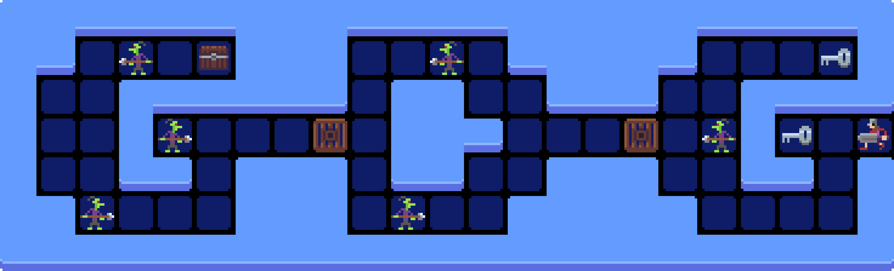

	

<h1 align="center">
	Graph Dungeon Generator
</h1>

  <b>Current Framework Version: 0.4.0</b>

## Description
This project generates game dungeons similar to the first zelda dungeons with only normal keys (no key items or breakable walls). The code is based on Joris Dormans' work in [dungeon generation](http://sander.landofsand.com/publications/Dormans_Bakkes_-_Generating_Missions_and_Spaces_for_Adaptable_Play_Experiences.pdf) for [Unexplored](https://store.steampowered.com/app/506870/Unexplored/).

## Features
- generate a graph of mission graph that describe how to solve the level similar to Mark Brown's Graph in [Boss Keys series](https://www.youtube.com/playlist?list=PLc38fcMFcV_ul4D6OChdWhsNsYY3NA5B2).
- generate a 2D grid of equal sized rooms for the mission graph similar to the [first zelda dungeon layout](http://www.gamasutra.com/view/feature/6582/learning_from_the_masters_level_.php?print=1). The number of generated rooms will be equal to the number of

## Guide
The project consists of two generators:
- **Mission Graph**: generates a graph that consitute the game's mission.
- **Layout Map**: lays down the graph on a 2D grid of cells where each cell can be connected from any of the four main directions (North, South, East, and West).

### Mission Graph
The **Mission Graph** consists of 7 different type of nodes that can be found in the enum `ObstacleTowerGeneration.MissionGraph.NodeType`. Each node represent different game room:
- **Start**: is the room where the level starts.
- **End**: is the room where the level ends.
- **Key**: is a room that has to have a key in it.
- **Lock**: is a room that can only be reached through one door that is locked and require a key to open.
- **Lever**: is a room that connects rooms from behind a lock room to rooms that are before.
- **Puzzle**: is a room that involve a challenge that need to be passed to move on.
- **Normal**: is any other room other than the previous ones.

Every node in the **Mission Graph** have an access level. An access level is a number that determines how many **Puzzle** and **Lock** nodes you passed on before reaching that node. For example: a node with access level of 0 means that it is connected to the start node without having any puzzle or lock nodes in between, while a node with access level of 2 means that there is two nodes of type **Puzzle** or **Lock** in between the start node and that node. The access level is very helpful in generating the **Layout Map** and also for generating **Lever** nodes.

The **Mission Graph** uses graph grammar to generate the mission. All the grammar is implemented in `grammer/` folder. There is 8 different grammar rules:
- `addNormal`: adds a **Normal** node between two nodes of the same level.
- `addPuzzle`: adds a **Puzzle** node between two nodes of the same level which will raise the second node level.
- `addKeyLock`: adds a **Lock** node between two nodes of the same level which will raise the second node access level, then add a **Key** node as a branch from the first node.
- `addNormalToKey`: add a **Normal** node between two nodes of the same level where the second node is a **Key** node.
- `addLever`: connects a high access level node to a low access level node using a **Lever** node.
- `makeLink`: connects two nodes of the same access level using a normal link.
- `makeBranching`: change the structure of three consecutive nodes to make them as branching nodes.
- `moveLockBack`: moves a normal task from behind a **Lock** node towards before which will decrease its access level.

To adjust the generated **Mission Graph** use the `graphRecipe.txt` file. The file consists of several lines where the system applies each line in order for 0 to many times. If any line starts with a **#** the system will consider it as a comment and ignore it. Each line consists of 3 parts separated with commas:
- **Rule Name**: is the name of the rule that need to be applied. If the system didn't find that rule defined, it will apply a random rule. You can use that point to apply random rules by writing **random** in the rule name.
- **Minimum Number**: is the minimum number of times the system has to run that rule.
- **Maximum Number**: is the maximum number of times the system has to run that rule.
For example: `addNormal, 0, 3` means the system will apply addNormal rule between 0 and 3 times. At any time, the user can remove one or two of the arguments. For example: `addNormal, 3` will apply addNormal 3 times, while `addNormal` will apply it 1 time.

### Layout Map
The layout map is the physical representation of the **Mission Graph** in 2D space. The layout map consists of 2D grid of `ObstacleTowerGeneration.LayoutGrammar.Cell` The layout make sure the start node and end node has only one connections while the rest of cells can have up to four connections (North, South, East, and West).

There is two types of cells:
- `Normal`: are cells that corresponds to a certain node in the **Mission Graph**.
- `Connection`: are additional cells that were added to facilitate connections in the physical space.

Each cell has from 1 door up to 4 doors. Doors are the connection between cells in the phyiscal space. There is 4 different door types:
- `Open`: means that it is a normal opening between these two cells.
- `KeyLock`: means that it needs a key to go through it.
- `LeverLock`: means it will open using a lever in the nearby lever room.
- `PuzzleLock`: means it will open when solving a puzzle in the nearby puzzle room.

### How to use the Code
You can generate a dungeon using `generateDungeon` function in `ObstacleTowerGeneration.Program` file. The function takes 3 parameters which identify the number of times the system will try to generate the dungeon. Default values are 100 for each of the dungeon pieces and 100 for the total dungeon.

The `generateDungeon` function returns a `DungeonResult` struct. The `DungeonResult` struct consists of 2 parts:
- `missionGraph`: is a `ObstacleTowerGeneration.MissionGraph.Graph` object that represents the generated **Mission Graph**.
- `layoutMap`: is a `ObstacleTowerGeneration.LayoutGrammar.Map` obejct that represents the generated **Layout Map**.

#### ObstacleTowerGeneration.MissionGraph.Graph
Graph object is a list of `ObstacleTowerGeneration.MissionGraph.Node` objects that consitutes the full graph. Each node has `accessLevel`, `type`, and `id` properties. `accessLevel` is an int that reflects the value of the access level of the node, `type` is an enum that reflects the node Type, and `id` is a unique integer that identify each node. Node object also have `getChildren` function that return a list of nodes that are connected to it.

#### ObstacleTowerGeneration.LayoutGrammar.Map
Map object has a function called `get2DMap` that returns a 2D grid of `ObstacleTowerGeneration.LayoutGrammar.Map` that consitutes the level layout. Each point in the grid can be a `null` if empty or a `ObstacleTowerGeneration.LayoutGrammar.Cell` object if it is not empty. Cell objects has `type` and `node` properties; and a `getDoor` function. `type` is an enum that reflects if the cell type. `node` is a reference to the corresponding node from the **Mission Graph** if the cell type is `Normal` and null otherwise. `getDoor` function takes an x dir and y dir then returns an enum that corresponds to the door type in that direction.
